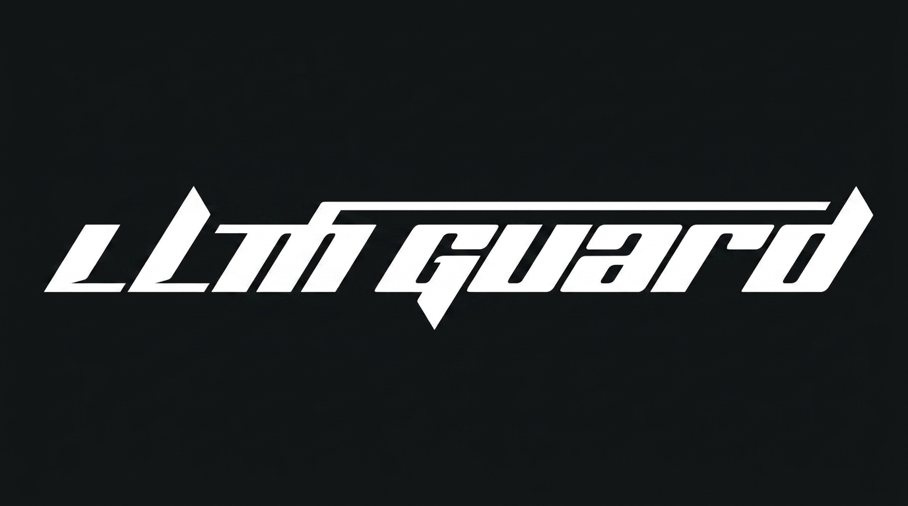

<p align="center">
  
</p>

<h1 align="center">LLM Guard & Observability Harness 🛡️📊</h1>

<p align="center">
  <a href="https://pypi.org/project/llm-guard-obs/"></a>
  <a href="https://github.com/your-username/llm-guard-observability/actions/workflows/release.yml"></a>
  <a href="https://github.com/your-username/llm-guard-observability"></a>
  <a href="https://opentelemetry.io/"></a>
  <a href="https://opensource.org/licenses/MIT"></a>
</p>

An enterprise open-source middleware proxy and observability stack built to inspect, secure, and monitor large language model interactions at scale with $<15\text{ms}$ latency overhead. A drop-in alternative to expensive SaaS observability tools like LangSmith or Datadog.

---

## 🚀 Key Features

- **Low-Latency Protection (<15ms Overhead):** Scans incoming prompts and streaming completions for prompt injections, system prompt leaks, toxicity, and PII BEFORE dispatching requests to LLMs—preventing wasted tokens.
- **Drop-In Integration:** Native support for **FastAPI / ASGI**, **LangChain**, **LlamaIndex**, and direct **OpenAI / Claude SDKs**.
- **Distributed Tracing (W3C Standard):** Implements OpenTelemetry trace propagation (`traceparent`), tracking multi-agent parent-child loops, token consumption costs ($C_{in}, C_{out}$), TTFT, and TPOT.
- **Async LLM-as-a-Judge Pipeline:** Continuously samples 5%–10% of production traffic asynchronously to score Groundedness, Faithfulness, and Answer Relevance into structured JSON output.
- **2% Threshold Circuit Breaker:** Automatically trips when upstream model error rates exceed 2%, routing traffic to a secondary provider or local vector semantic cache.

---

## 📦 Installation

```bash
pip install llm-guard-obs
```

---

## 🛠️ Quickstart Usage

### 1. FastAPI / ASGI Drop-In Middleware

```python
from fastapi import FastAPI
from llm_guard_obs import LLMGuardMiddleware

app = FastAPI()
app.add_middleware(LLMGuardMiddleware)

@app.post("/v1/chat/completions")
async def chat_completions(request: Request):
    return {"message": "Protected by LLM Guard"}
```

### 2. LangChain Callback Integration

```python
from llm_guard_obs import LLMGuardLangChainCallback
from langchain_openai import ChatOpenAI

handler = LLMGuardLangChainCallback()
llm = ChatOpenAI(callbacks=[handler])
response = llm.invoke("What are cloud security best practices?")
```

### 3. LlamaIndex Event Handler Integration

```python
from llm_guard_obs import LLMGuardLlamaIndexHandler
from llama_index.core import Settings

handler = LLMGuardLlamaIndexHandler()
Settings.callback_manager.add_handler(handler)
```

---

## 📊 Open-Source Metrics & Dashboard Stack

Launch the complete Gateway, OpenTelemetry Collector, Prometheus, and Grafana stack using Docker Compose:

```bash
docker-compose up -d
```

- **Prometheus Metrics:** Exposed at `http://localhost:8889/metrics`
- **Grafana Dashboard:** Pre-configured dashboard available at `http://localhost:3000` (Import [`config/grafana_dashboard.json`](config/grafana_dashboard.json))

---

## 🧪 Running Quality Gates & Tests

```bash
# Run pytest with 90%+ coverage gate
py -m pytest --cov=src --cov-fail-under=90 tests/
```

---

## 📄 License

Distributed under the MIT License. See `LICENSE` for more information.
